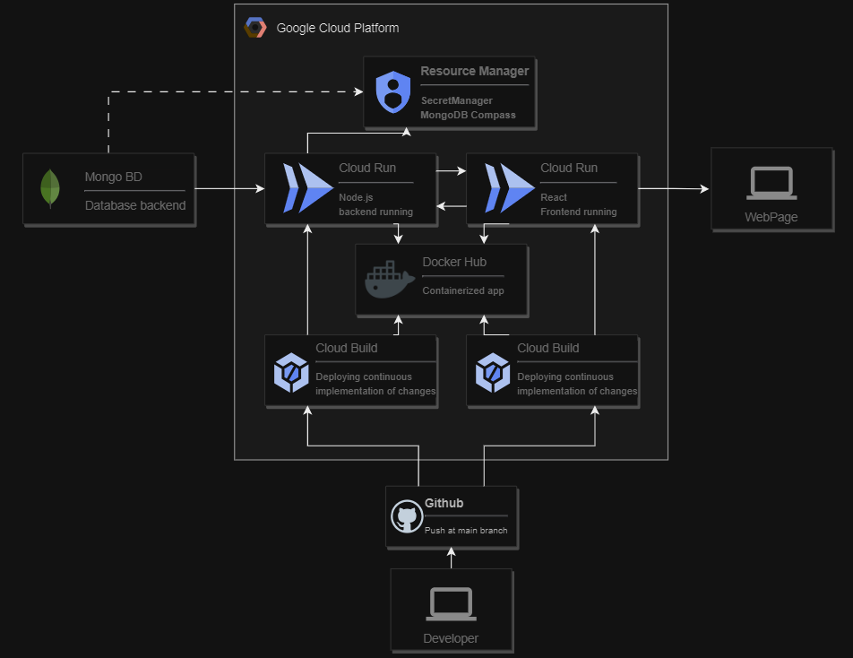

#  React NodeJS Cloud Builds

This project guides you through setting up an app with a React front-end and a Node.js back-end. It seamlessly integrates automatic deployment on Cloud Run through Cloud Build.




## User Creation with MERN Full Stack

Built on the MERN Full Stack (MongoDB, Express, React, Node.js), this project utilizes MongoDB as the database with Mongoose for user-friendly CRUD operations.

### Project Views:

- **Home:**
  Users can access:
  - User Registration: Create new user accounts.
  - Database: Query and retrieve stored information.

- **Registration (Register):**
  View to register new users in the MongoDB database.

- **Database:**
  Allows users to query and retrieve information from the database.

Explore a brief description of key terms in the project.

- **MongoDB:** NoSQL database for project data.
- **Express:** Node.js framework for the backend RESTful API.
- **React:** JavaScript library for the frontend.
- **Node.js:** JavaScript runtime environment for the backend.

## How It's Built?

### Database Creation
Go to MongoDB website.
Sign up, create a project in MongoDB Atlas.
Build a Database, connect with MongoDB Compass.

### Secret manager creation:
Enable secret manager API and create the DB_URL_ATLASsecret with the MongoDB Compass value 
```bash
mongodb+srv://<username>:<password>@cluster0.2lnyz2p.mongodb.net/
```

### Trigger cloud build with push a main creation
Create two triggers for each cloudbuild yaml and enable all the connections.

### Bugs deBugs

>*default Cloud Build service account "<>@cloudbuild.gserviceaccount.com" does not have secretmanager.versions.access permissions for secret "<>DB_URL_ATLAS"*
Secret Manager Admin to Cloud Build Service Account 

